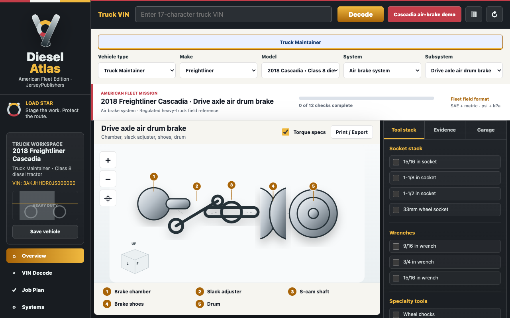

# DieselAtlas: Truck Repair Planner

Truck VIN identity, commercial air-brake safety gates, and fleet job planning.

## Distinct Use Case

Treats stored spring-brake energy, regulated inspection, and dispatch closeout as first-class workflow gates.

## Version 1.5.0

- User-initiated NHTSA vPIC truck VIN decode
- Freightliner Cascadia air-brake demonstration
- Wheel-chock, air-isolation, spring-brake, leak, response, documentation, and dispatch checks
- Direct 49 C.F.R. Part 393 evidence and exact-fleet-procedure limits

- Free, ad-free, account-free, analytics-free, and open source.
- Local repair checks, notes, saved equipment, and imported open-data packs.
- Original orientation diagrams; no copied manufacturer schematics.
- Evidence quality, limitations, safety gates, and primary-source links remain visible.

## Accuracy And Authority

This extension is a planning and orientation reference, not an official service manual, inspection, certification, or authorization. FMCSA, DOT, EPA, employer/fleet procedures, inspection requirements, and return-to-service authority control. Stop when the installed equipment differs and verify current official information before safety-critical work.

## Privacy

- Hosted policy: https://builtbydasilva.github.io/diesel-atlas/privacy-policy.html
- Source policy: [docs/privacy-policy.md](docs/privacy-policy.md)
- Store listing and reviewer steps: [docs/store-listing.md](docs/store-listing.md)

GarageAtlas and DieselAtlas send a user-entered VIN only to NHTSA vPIC after Decode is pressed. MarineAtlas, AeroAtlas, and RailAtlas validate identifiers locally and request no host permission. This repository contains only the permissions and dataset for **DieselAtlas**.

## Install Locally

1. Open `chrome://extensions`.
2. Enable **Developer mode**.
3. Choose **Load unpacked** and select this repository folder.
4. Open the extension popup or full workspace.

## Chrome Web Store Package

The tagged GitHub release includes:

- `diesel-atlas-chrome-extension-v1.5.0.zip`
- `diesel-atlas-marketing-assets-v1.5.0.zip`
- `SHA256SUMS-v1.5.0.txt`

## Open Source

MIT licensed by JerseyPublishers. Website: [JerseyPublishers.com](https://JerseyPublishers.com). This standalone repository is generated from the public [Atlas suite source](https://github.com/BuiltByDasilva/wrenchatlas) so safety fixes can remain consistent across equipment domains.

Manifest description: Truck VIN decode, air-brake tool staging, regulated safety gates, job records, and FMCSA-linked evidence for diesel mechanics.
